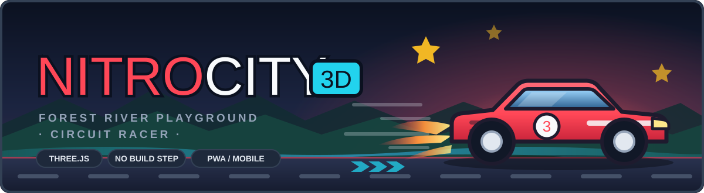

<p align="center">
  
</p>

<p align="center">
  <a href="https://hammadshakeelai.github.io/NitroCity/"></a>
  
  
  
</p>

# NitroCity 3D 🏎️

A 3D cartoon car game inspired by **Bruno Simon's 3D Playground** and **Kenney's Car Kit** aesthetic. Built with pure **Three.js**, lightweight arcade physics, Web Audio procedural sound, and mobile touch controls.

### ▶ [**Play it live →**](https://hammadshakeelai.github.io/NitroCity/)

No install, no build step — it runs straight in the browser, desktop or phone.

---

## 🎮 Game Modes

1. **🏙️ City Free-Roam (Sandbox)**
   - Cruise through a vibrant cartoon city grid with avenues and sidewalk curbs.
   - Hit stunt ramps to launch over road intersections.
   - Knock over stacks of toy crates with Bruno Simon style physics.
   - Collect 10 hidden golden stars scattered across rooftops, alleyways, and plazas.
   - Unflip/reset your car anytime with `R` or on-screen button.

2. **🏁 Circuit Track Race**
   - A closed-loop asphalt racetrack with red/white curbs, grandstands, and start/finish gantry.
   - 3-2-1-GO! countdown with audio beeps.
   - 2 AI rival cars navigating the track in real-time.
   - 3-lap championship race with lap timers, checkpoint validation, and podium finish.

---

## 🕹️ Controls

| Action | Desktop Keyboard | Mobile Touch |
| :--- | :--- | :--- |
| **Accelerate** | `W` or `Up Arrow` | `▲` Green Pedal (Right side) |
| **Brake / Reverse** | `S` or `Down Arrow` | `▼` Red Pedal (Right side) |
| **Steer Left / Right** | `A` / `D` or `◄` / `►` | `◀` / `▶` Buttons (Left side) |
| **Handbrake / Drift** | `SPACE` | `⚡` Button (Right side) |
| **Reset / Unflip Car** | `R` | `🔄` HUD Button |
| **Return to Menu** | `ESC` | `🏠` HUD Button |
| **Toggle Sound** | Click 🔊 in HUD | Tap 🔊 in HUD |

---

## 🚀 Quick Play (Browser)

Simply double-click `index.html` to open it directly in Google Chrome, Microsoft Edge, Firefox, or Safari!
Or serve locally with any static HTTP server:

```bash
# Python
python -m http.server 8000

# Node.js
npx serve
```
Then visit `http://localhost:8000` (or `http://localhost:3000`).

---

## 📱 Export to Native Mobile App (Capacitor)

To package this game into a native Android APK:

```bash
# 1. Initialize Capacitor dependencies
npm init -y
npm install @capacitor/core @capacitor/cli @capacitor/android

# 2. Add Android platform
npx cap add android

# 3. Open in Android Studio to build & run APK
npx cap open android
```
In Android Studio, click **Build > Build Bundle(s) / APK(s) > Build APK(s)** to get your `.apk` ready for your phone!
