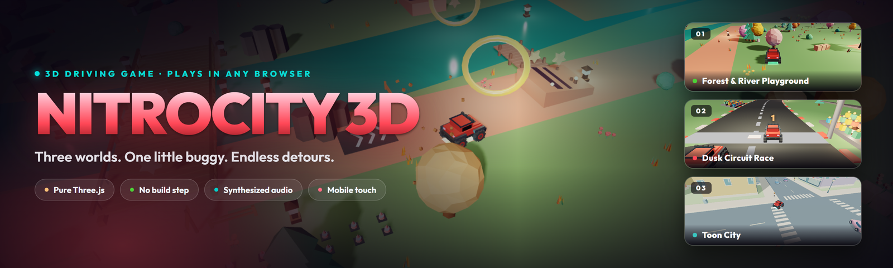
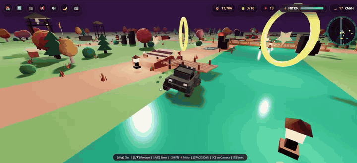
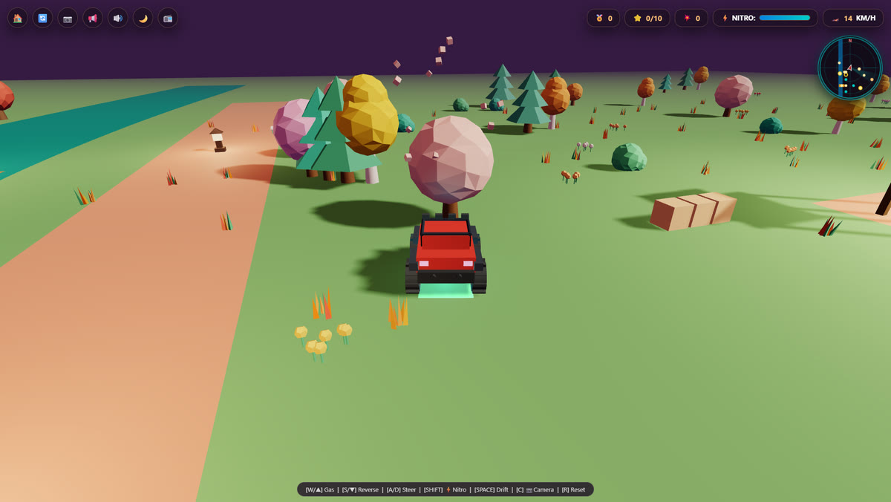
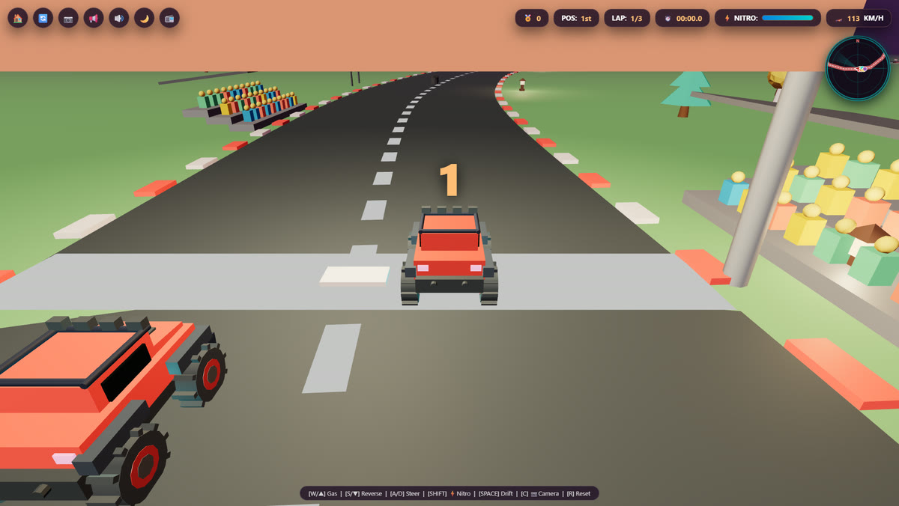
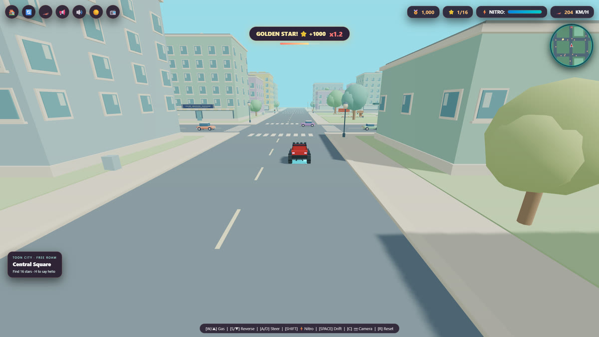
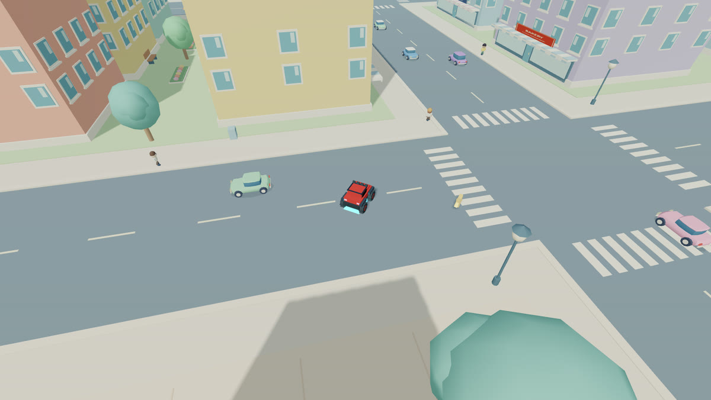

<p align="center">
  
</p>

<p align="center">
  <a href="https://hammadshakeelai.github.io/NitroCity/"></a>
  
  
  
  
</p>

<h3 align="center">A stylized 3D driving game that runs in a browser tab.<br>Three worlds, one little buggy, no install.</h3>

<p align="center">
  <a href="https://hammadshakeelai.github.io/NitroCity/"><b>▶ Play it live →</b></a>
</p>

<p align="center">
  
</p>

<p align="center">
  <b>▶ <a href="assets/trailer.mp4">Watch the 44-second trailer</a></b> — real gameplay, and the soundtrack is the game's own radio, synthesized live in the browser.
</p>

---

## What it is

NitroCity 3D is a cartoon off-road driving game built with **plain Three.js** — no engine, no bundler, no build step, and **no art or audio files at all**: the game loads zero textures, models or sound files. Every car, tree, building and sound is generated at runtime, in about 7,000 lines of HTML, CSS and JavaScript. (The only binaries in this repo are the banner, screenshots and trailer on this page.) The whole game is `index.html` plus two scripts for the city, served straight off GitHub Pages.

It's inspired by **Bruno Simon's 3D portfolio** and the **Kenney Car Kit** look: chunky low-poly shapes, flat pastel colours, and arcade physics that let you drift, jump and smash things.

---

## Three worlds

<table>
<tr>
<td width="33%"></td>
<td width="33%"></td>
<td width="33%"></td>
</tr>
<tr>
<td align="center"><b>01 · Forest &amp; River</b><br><sub>Free roam</sub></td>
<td align="center"><b>02 · Dusk Circuit</b><br><sub>3 laps, 6 rivals</sub></td>
<td align="center"><b>03 · Toon City</b><br><sub>Open world</sub></td>
</tr>
</table>

### 🌲 Forest & River Playground — free roam

Dusk in a pine-and-autumn forest cut through by a turquoise river.

- Cross the **wooden bridges**, or splash straight through the ford.
- Launch off **river ramps**, **boost pads** and floating **stunt rings**, and chain **stunt combos** into an escalating multiplier.
- **Smash** toy crates, barricades, tire walls and explosive fuel drums — they burst into voxel debris.
- Find **10 golden stars** hidden across the map.
- Solid world: trees, watchtowers, tents and docks deflect you instead of firing you backwards.
- Flipped over? `R` resets you.

### 🏁 Dusk Circuit Race — 3 laps

Off-road circuit racing against **6 AI rivals** — Blaze, Viper, Titan, Phantom, Turbo and Sparky.

- 3‑2‑1‑GO countdown, live lap timer and a podium finish.
- **Rubber-banded rivals** keep the field bumper-to-bumper instead of deciding the race in turn one.
- **Car-to-car collisions** — trading paint actually pushes you around.
- Off-track grip loss with a live HUD tag, plus rumble curbs that shake the camera.
- **4-sector checkpoint validation**, so a lap record means you actually drove the lap.

### 🏙️ Toon City — open world

A bright **820 × 820** cartoon city: 36 blocks, **114 pastel buildings**, shopfronts, leafy parks, a clocktower square and a waterfront promenade.

- **42 moving cars** follow the streets, slow for traffic and yield to your buggy.
- **96 walking neighbours** stay on the sidewalks and react to your horn.
- **16 golden stars** to find, with a street minimap and neighbourhood names to guide you.
- Districts announce themselves as you drive — Central Square, Sunbeam Park, Harbor Walk, Pastel Village, Pool Club.

<p align="center">
  
</p>

---

## Systems

| | |
| :--- | :--- |
| 🎨 **Vehicle garage** | 6 paint schemes with matching neon underglow, saved between sessions |
| ⚡ **Graphics quality** | LOW (no shadows, 1× DPR — for phones), MED, HIGH (soft shadows, native DPR) |
| 🌙 **Time of day** | Toggle Midnight, Golden Hour and Daylight in any world |
| 📻 **In-car radio** | Neon Drive 104.2 FM · Cyber Rush 168.0 FM · Midnight Drift 88.5 FM — all sequenced live |
| 🎥 **Camera** | Chase, isometric diorama, top-down and bumper cam, plus wheel/pinch zoom |
| 🏅 **Stunt combos** | Big air, 360 spins, drifts and smashes chain into a multiplier |
| 🗺️ **Radar minimap** | Live stars, ramps, boost pads and rivals |
| 💾 **Persistence** | Best lap, high stunt score, stars found and paint choice survive a reload |
| 📱 **Mobile** | Full touch controls, landscape and portrait, installable as a PWA |

---

## Controls

| Action | Keyboard | Touch |
| :--- | :--- | :--- |
| **Accelerate** | `W` / `↑` | `▲` pedal (right) |
| **Brake / reverse** | `S` / `↓` | `▼` pedal (right) |
| **Steer** | `A` `D` / `←` `→` | `◀` `▶` (left) |
| **Nitro boost** | `SHIFT` | `💨` |
| **Handbrake / drift** | `SPACE` | `⚡` |
| **Cycle camera** | `C` | `📷` |
| **Reset / unflip** | `R` | `🔄` |
| **Horn** | `H` | `📢` |
| **Next radio station** | `Q` | `📻` |
| **Time of day** | — | `🌙` |
| **Pause** | `P` | — |
| **Fullscreen** | `F` | — |
| **Back to menu** | `ESC` | `🏠` |
| **Zoom** | Mouse wheel | Pinch |

---

## Under the hood

The interesting part isn't the driving, it's what had to happen to keep a 32,000-object city running on a phone in a browser tab.

- **Nothing to load.** The game fetches no textures, models or audio — meshes are built from Three.js primitives, and every engine note, tire squeal, crash and radio track is synthesized with the **Web Audio API** at runtime. (The `assets/` binaries are the README's media, not the game's.)
- **Instanced, chunked city.** Toon City holds ~32,500 instanced objects across 77 chunks but only draws the ones near you: the visible scenery resolves to roughly **70–80 draw calls**, with traffic and pedestrians adding about a dozen more, and 291 collision volumes looked up by proximity instead of iterated.
- **Delta-time normalized physics.** The driving model is frame-rate independent, so a 144 Hz desktop and a 30 fps phone drive the same.
- **Explicit teardown.** Every world disposes its geometries, materials and instanced meshes on exit, so switching maps doesn't leak GPU memory.
- **Distance-based detail.** Scenery, pedestrians and traffic drop detail with distance; particles are pooled and bounded.
- **One runtime dependency.** Three.js r128 from a CDN, precached by the service worker so the game still runs offline. The only other outside fetch is the pair of PWA install icons hotlinked from icons8 in `manifest.json`.

---

## Run it locally

Open `index.html` in any modern browser, or serve the folder:

```bash
python -m http.server 8000
```

Then visit <http://localhost:8000>.

Jump straight into a world with a URL parameter:

```text
index.html?mode=city      ->  Forest & River Playground
index.html?mode=race      ->  Dusk Circuit Race
index.html?mode=tooncity  ->  Toon City
```

---

## Package as an Android app (Capacitor)

```bash
npm init -y
npm install @capacitor/core @capacitor/cli @capacitor/android
npx cap add android
npx cap open android
```

Then in Android Studio: **Build → Build Bundle(s) / APK(s) → Build APK(s)**.

---

## Development notes

Toon City lives in [`assets/toon-city-world.js`](assets/toon-city-world.js) (static scenery) and [`assets/toon-city-life.js`](assets/toon-city-life.js) (traffic and pedestrians). Everything else is in `index.html`. There is still no build step.

Browser regression checks are in [`tests/toon-city-check.mjs`](tests/toon-city-check.mjs). With Playwright and Chromium installed, start the local server above and run:

```bash
node tests/toon-city-check.mjs
```

Set `PLAYWRIGHT_PACKAGE` to point at an existing Playwright install. Screenshots and the JSON report go to the git-ignored `scratch/toon-city-results` directory.

`?test=1` enables manual simulation: `window.advanceTime(ms)` steps the game deterministically and `window.render_game_to_text()` dumps gameplay and rendering state as JSON. Leave it off when actually playing.

[`claude-review.md`](claude-review.md) is a playability review of the driving model — frame-rate dependence, collision response, foliage draw calls, AI behaviour and lap validation — with line references and the reasoning behind each fix. Most of it is implemented; **foliage instancing** is the main item still open.

---

## Credits

Built by [@hammadshakeelai](https://github.com/hammadshakeelai). Visual direction inspired by [Bruno Simon's 3D portfolio](https://bruno-simon.com/) and [Kenney's Car Kit](https://kenney.nl/assets/car-kit). Rendering by [Three.js](https://threejs.org/).
